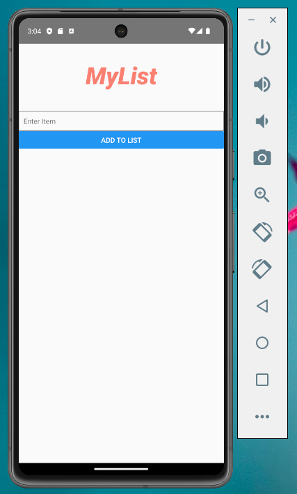

# Mobile App: MyList 

🚀 Welcome to my [**React Native**](https://reactnative.dev) project!

## Demo

## Overview

This project is a product of my exploration and learning journey in React Native. Developed as part of my study class, it showcases my hands-on experience with building mobile applications using this powerful framework.
## Technologies Used

- **React Native:** Core framework for mobile app development.
- **Android Studio:** Integrated development environment for Android app development.
- **JavaScript:** Primary programming language for React Native development.
- **Java Development Kit (JDK):** Version 17.0.9
- **Node.js:** Plays a key role in handling various development tasks and automation within the React Native project.
- **MMKV:** Key-value storage library for efficient data persistence in React Native.

## Features

- **Add and Remove Items:** Easily add new items to your list and remove them when they are completed.

- **Persistent Storage:** Utilizes MMKV for efficient and persistent storage, ensuring your list is saved even if you close the app.

- **React Native:** Built with React Native, allowing you to run your list on both iOS and Android platforms.
## How to Run
1. To carry out this project, we will primarily need the Node.js ecosystem and its package manager NPM. Please visit the following address:

https://nodejs.org/en/download

Install the latest stable version without the Chocolatey option.

2. Next, install the latest version of Android Studio:

https://developer.android.com/studio

Accept all the licenses requested during installation and then launch it. When the "Welcome to Android Studio" window opens, open the "More Actions" menu and select "SDK Manager." This will allow you to install the corresponding version(s) of Android. Also, accept the license for the installed version.

For the next step, go back to the opening window and, this time, select the "Virtual Device Manager" option from the "More Actions" menu. Delete the default emulator and create a new one corresponding to the previously installed Android version from the device of your choice.

3. Install Java JDK version 17.0.9, which you can find at the following address:
[jdk-17.0.9_windows-x64_bin.exe](https://www.oracle.com/fr/java/technologies/javase/jdk11-archive-downloads.html)

4. To test and compile this project, you will need to edit the system environment variables (here in Windows 11). Follow these steps:

    - Right-click on your Start menu.
    - Select `System`.
   -  Open `Advanced system settings`.
    - Click on `Environment Variables...`
    - In the `System Variables` window, click on `New`
    - The first variable should be named `ANDROID_HOME` with the value `C:\Users\your_username\AppData\Local\Android\Sdk`.
    - The second variable should be `JAVA_HOME` with the value `C:\Program Files\Java\jdk-17`.
    - Finally, add a new entry to the Path variable: `C:\Users\your_username\AppData\Local\Android\Sdk\platform-tools`.

5. Clone the repository: `git clone https://github.com/elledevelope/React-native-MyList-android`

6. Navigate to the project folder: `cd project-name`

7. Run the project: `npx react-native start`
## Feedback

Feel free to explore the code and provide any feedback!

## Author

👋 Hello, I'm [@elledevelope](https://github.com/elledevelope/)

- 🎓 Currently a student in web and mobile development.
- 💻 Passionate about crafting digital experiences.
- 🌱 Always seeking to learn and grow.

Let's connect! 📫 [elledevelope@gmail.com]

## Documentation

[React Native](https://reactnative.dev)

[Node.js](https://nodejs.org/en/download)

[Android Studio](https://developer.android.com/studio)

[Java JDK](https://www.oracle.com/fr/java/technologies/javase/jdk11-archive-downloads.html)
